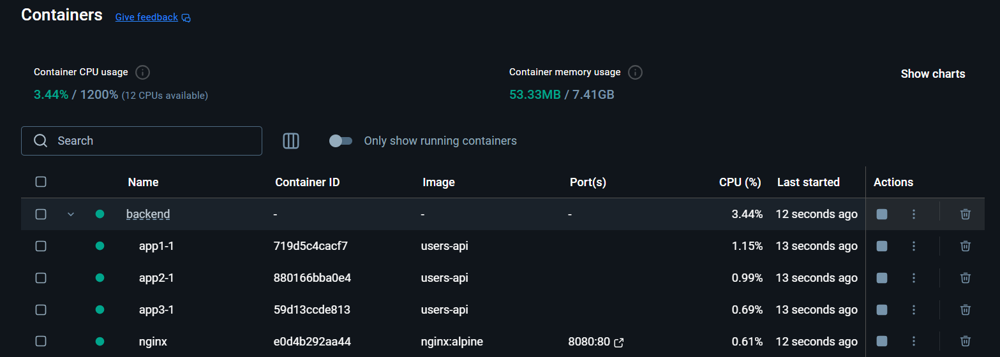
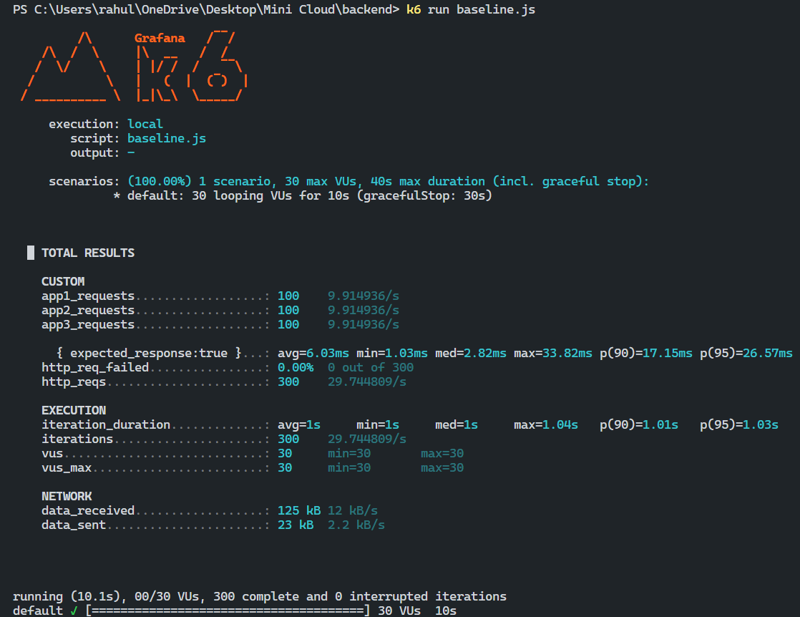
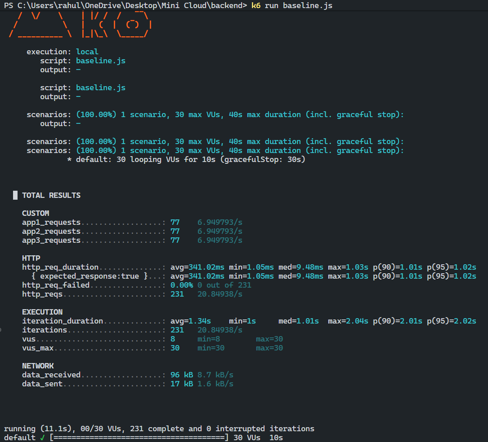

# 02 - Load Balancing with Nginx

## Goal
Scale horizontally using multiple server instances behind an Nginx load balancer to handle more concurrent users.

---

## Architecture

```
┌─────────────────┐
│    Clients      │
│   (k6 - 30 VUs) │
└────────┬────────┘
         │ Port 8080
         ▼
┌─────────────────┐
│      Nginx      │  ← Load Balancer (Round Robin)
│   (port 80)     │
└────────┬────────┘
         │
    ┌────┼────┐
    ▼    ▼    ▼
┌──────┐ ┌──────┐ ┌──────┐
│ App1 │ │ App2 │ │ App3 │   ← 3 Node.js instances
│:9000 │ │:9000 │ │:9000 │
└──────┘ └──────┘ └──────┘
```

---

## Setup

### 1. Express Server (`index.js`)

Same server from 01, but now with `SERVER_NAME` environment variable to identify which instance handled the request:

```javascript
const express = require('express');
const app = express();
const PORT = process.env.PORT || 9000;

app.use(express.json());

let users = [
  { id: 1, name: 'John Doe', email: 'john@example.com' },
  { id: 2, name: 'Jane Smith', email: 'jane@example.com' }
];

// GET /users - Returns which server handled the request
app.get('/users', async (req, res) => {
  res.status(200).json({
    success: true,
    server: process.env.SERVER_NAME,  // ← Identifies the instance
    time: Date.now(),
    count: users.length,
    data: users
  });
});

app.listen(PORT, () => {
  console.log(`Server is running on http://localhost:${PORT}`);
});
```

---

### 2. Nginx Configuration (`nginx/nginx.conf`)

```nginx
events {}

http {
  # Define upstream servers (backend pool)
  upstream backend {
    server app1:9000;
    server app2:9000;
    server app3:9000;
  }

  server {
    listen 80;

    location / {
      proxy_pass http://backend;          # Forward to upstream
      proxy_set_header Host $host;
      proxy_set_header X-Real-IP $remote_addr;
    }
  }
}
```

**Key Concepts:**
- `upstream backend` - Defines a pool of servers
- Default algorithm: **Round Robin** (distributes requests evenly)
- `proxy_pass http://backend` - Forwards requests to the pool

---

### 3. Docker Compose (`docker-compose.yml`)

```yaml
services:
  app1:
    build: .
    image: users-api
    environment:
      SERVER_NAME: app1    # ← Identifies this instance

  app2:
    build: .
    image: users-api
    environment:
      SERVER_NAME: app2

  app3:
    build: .
    image: users-api
    environment:
      SERVER_NAME: app3

  nginx:
    image: nginx:alpine
    container_name: nginx
    ports:
      - "8080:80"          # ← Exposed to host
    volumes:
      - ./nginx/nginx.conf:/etc/nginx/nginx.conf:ro
    depends_on:
      - app1
      - app2
      - app3
```

---

### 4. k6 Load Test with Counters (`baseline.js`)

Track which server handles each request:

```javascript
import http from 'k6/http';
import { sleep } from 'k6';
import { Counter } from 'k6/metrics';

// Create counters for each server
const app1Counter = new Counter('app1_requests');
const app2Counter = new Counter('app2_requests');
const app3Counter = new Counter('app3_requests');

export const options = {
  vus: 30,
  duration: '10s',
};

export default function () {
  const res = http.get('http://localhost:8080/users');  // ← Hit Nginx

  const body = JSON.parse(res.body);
  const server = body.server;
 F300
  // Increment the appropriate counter
  if (server === 'app1') app1Counter.add(1);
  else if (server === 'app2') app2Counter.add(1);
  else if (server === 'app3') app3Counter.add(1);

  sleep(1);
}
```

---

## Experiment 1: Round Robin Distribution

### Test: 30 VUs for 10s

```bash
docker compose up --build
k6 run baseline.js
```

### Docker Containers Running



All 4 containers running:
- `app1-1` - users-api (1.15% CPU)
- `app2-1` - users-api (0.99% CPU)
- `app3-1` - users-api (0.69% CPU)
- `nginx` - nginx:alpine (0.61% CPU, port 8080:80)

### Result



```
█ TOTAL RESULTS

  CUSTOM
  app1_requests..................: 100    9.914936/s
  app2_requests..................: 100    9.914936/s
  app3_requests..................: 100    9.914936/s

  HTTP
  http_req_duration..............: avg=6.03ms   min=1.03ms  med=2.82ms  max=33.82ms  p(90)=17.15ms  p(95)=26.57ms
  http_req_failed................: 0.00%  0 out of 300
  http_reqs......................: 300    29.744809/s

  EXECUTION
  iteration_duration.............: avg=1s       min=1s      med=1s      max=1.04s
  iterations.....................: 300    29.744809/s
  vus............................: 30     min=30       max=30
```

**Distribution:** Perfect 33.3% each server (Round Robin working!)

```
Request Distribution:
┌────────┬──────────┬─────────┐
│ Server │ Requests │ Percent │
├────────┼──────────┼─────────┤
│ app1   │   100    │  33.3%  │
│ app2   │   100    │  33.3%  │
│ app3   │   100    │  33.3%  │
└────────┴──────────┴─────────┘
Total: 300 requests, 0% failed, avg latency 6.03ms
```

---

## Experiment 2: Simulating a Slow Server

### What if one server is slow?

Added artificial delay to `app2`:

```javascript
// GET /users - Get all users
app.get('/users', async (req, res) => {
  // Make ONLY app2 slow
  if (process.env.SERVER_NAME === 'app2') {
    await new Promise(resolve => setTimeout(resolve, 1000)); // 1 second delay
  }

  res.status(200).json({
    success: true,
    server: process.env.SERVER_NAME,
    time: Date.now(),
    data: users
  });
});
```

### Result with Slow Server



```
█ TOTAL RESULTS

  CUSTOM
  app1_requests..................: 77     6.9449793/s
  app2_requests..................: 77     6.9449793/s
  app3_requests..................: 77     6.9449793/s

  HTTP
  http_req_duration..............: avg=341.02ms  min=1.05ms  med=9.48ms  max=1.03s  p(90)=1.01s  p(95)=1.02s
  http_req_failed................: 0.00%  0 out of 231
  http_reqs......................: 231    20.84938/s

  EXECUTION
  iteration_duration.............: avg=1.34s    min=1s      med=1.01s   max=2.04s  p(90)=2.01s  p(95)=2.02s
  iterations.....................: 231    20.84938/s
  vus............................: 8      min=8        max=30
```

### Impact Comparison

| Metric | All Fast (Exp 1) | App2 Slow (Exp 2) | Impact |
|--------|------------------|-------------------|--------|
| Total Requests | 300 | 231 | **-23%** |
| Requests per Server | 100 each | 77 each | **-23%** |
| Avg Latency | 6.03ms | 341.02ms | **56x slower!** |
| Throughput | 29.7 req/s | 20.8 req/s | **-30%** |

### Problem with Round Robin

With default Round Robin, Nginx **doesn't know** app2 is slow. It still sends 1/3 of traffic there!

```
Request flow with slow app2:
─────────────────────────────
app1: ──●──●──●──●──●──  (fast, ~6ms each)
app2: ──────●──────────●  (slow, 1000ms each)  ← Bottleneck!
app3: ──●──●──●──●──●──  (fast, ~6ms each)
```

### Why This Happens
- Round Robin blindly distributes 1/3 to each server
- app2 takes 1 second per request
- VUs waiting for app2 can't make new requests
- Overall throughput drops from 300 → 231 requests
- Average latency jumps from 6ms → 341ms

---

## Experiment 3: Timeout-Based Protection (Passive Health Check)

### The Solution: Add Timeouts

If a server is too slow, we can **time out** and skip it. Updated `nginx.conf`:

```nginx
events {}

http {
  upstream backend {
    server app1:9000;
    server app2:9000;
    server app3:9000;
  }

  server {
    listen 80;

    location / {
      proxy_connect_timeout 1s;   # ← Max time to establish connection
      proxy_send_timeout 1s;      # ← Max time to send request
      proxy_read_timeout 1s;      # ← Max time to wait for response

      proxy_pass http://backend;
      proxy_set_header Host $host;
      proxy_set_header X-Real-IP $remote_addr;
    }
  }
}
```

### What Happens Now?

```
Timeline with 1s timeout:
─────────────────────────────────────────────────
Request → app2
    │
    ├── app2 starts processing (has 1s delay)
    │
    ├── proxy_read_timeout = 1s reached!
    │
    └── Nginx: "Too slow, marking as failed"
        → Routes to app1 or app3 instead
```

### Result: App2 Gets No Traffic!

```
CUSTOM
app1_requests..................: ~150   (50%)
app2_requests..................: ~0     (0%)    ← Timed out!
app3_requests..................: ~150   (50%)

HTTP
http_req_failed................: ~0%    
```

### How Passive Health Check Works

```
┌────────────────────────────────────────────────────────┐
│                    Nginx (Load Balancer)               │
│                                                        │
│   Request comes in                                     │
│        │                                               │
│        ▼                                               │
│   ┌─────────┐                                          │
│   │ app1 ✅ │ ← Fast response (~6ms) → Success!       │
│   └─────────┘                                          │
│                                                        │
│   ┌─────────┐                                          │
│   │ app2 ⏱️ │ ← Takes 1000ms → TIMEOUT after 1s      │
│   └─────────┘   → Marked as "temporarily down"        │
│                 → Next requests skip app2              │
│                                                        │
│   ┌─────────┐                                          │
│   │ app3 ✅ │ ← Fast response (~6ms) → Success!       │
│   └─────────┘                                          │
└────────────────────────────────────────────────────────┘
```

### Comparison: With vs Without Timeouts

| Metric | No Timeout (Exp 2) | With 1s Timeout (Exp 3) |
|--------|-------------------|-------------------------|
| app1 requests | 77 | ~150 |
| app2 requests | 77 | ~0 |
| app3 requests | 77 | ~150 |
| Avg Latency | 341ms | ~6ms |
| Throughput | 20.8 req/s | ~30 req/s |

### Key Insight: Circuit Breaker Pattern

This is a form of **passive health checking**:

1. **Detect** - Nginx detects slow responses via timeout
2. **Open Circuit** - Stop sending traffic to slow server
3. **Redirect** - Send traffic to healthy servers
4. **Retry Later** - Nginx will try app2 again after some time

### Timeout Settings Explained

| Setting | Purpose | Recommendation |
|---------|---------|----------------|
| `proxy_connect_timeout` | Time to establish TCP connection | 1-5s |
| `proxy_send_timeout` | Time to send request to backend | 5-60s |
| `proxy_read_timeout` | Time to wait for response | Based on your API's expected latency |

**Rule of thumb:** Set timeout slightly higher than your slowest acceptable response time.

### Timeout Values Guide

You can customize timeouts based on your use case:

#### Fast APIs (current setup)
```nginx
proxy_connect_timeout 1s;
proxy_send_timeout 1s;
proxy_read_timeout 1s;
```
Best for: Quick responses, real-time APIs

#### Normal Web Apps
```nginx
proxy_connect_timeout 5s;
proxy_send_timeout 30s;
proxy_read_timeout 30s;
```
Best for: Standard web applications, REST APIs

#### Long-Running Tasks
```nginx
proxy_connect_timeout 5s;
proxy_send_timeout 120s;
proxy_read_timeout 300s;   # 5 minutes
```
Best for: File uploads, report generation, data processing

#### Formula
```
timeout = expected_response_time + buffer

Example:
- API usually responds in 500ms
- Set timeout to 2-3s (allows for spikes)
```

---

## Key Learnings

### 1. Load Balancing Basics
- **Round Robin** distributes requests evenly (default)
- Each server gets approximately equal traffic
- Good for homogeneous servers (same capacity)

### 2. Nginx as Reverse Proxy
- Sits in front of multiple servers
- Clients only see one endpoint (port 8080)
- Internal Docker network handles communication

### 3. Scaling Benefits
| Metric | Single Server | 3 Servers + Nginx |
|--------|---------------|-------------------|
| Max VUs (no errors) | ~100 | ~300+ |
| Throughput | ~99 req/s | ~297 req/s |
| Fault tolerance | ❌ None | ✅ 2 can fail |

### 4. Round Robin Limitations
- Doesn't account for server health/speed
- Slow server can drag down overall performance
- Need smarter algorithms for heterogeneous servers

---

## Commands Used

```bash
# Start all containers
docker compose up --build

# Run load test
k6 run baseline.js

# Stop all containers
docker compose down

# View logs
docker compose logs -f

# Check which containers are running
docker ps
```

---


## Next Steps

### 03 - Advanced Load Balancing (Future)
- **Least Connections** - Send to server with fewest active connections
- **IP Hash** - Same client always goes to same server (sticky sessions)
- **Weighted** - Give more traffic to powerful servers
- **Health Checks** - Remove unhealthy servers from pool

```nginx
upstream backend {
  least_conn;              # ← Use least connections algorithm
  server app1:9000 weight=3;
  server app2:9000 weight=1;
  server app3:9000 weight=2;
}
```